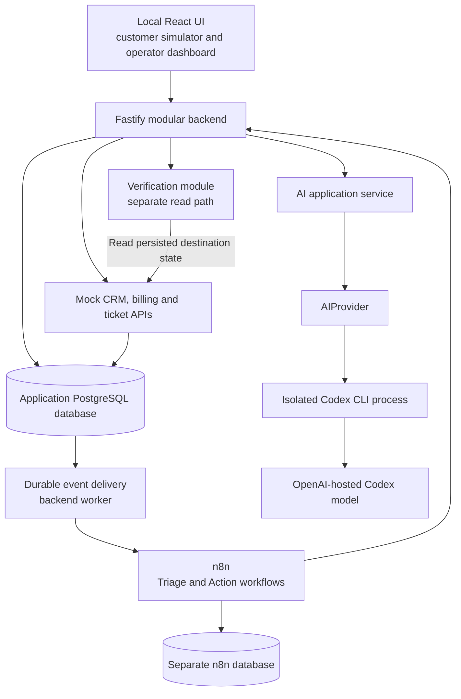
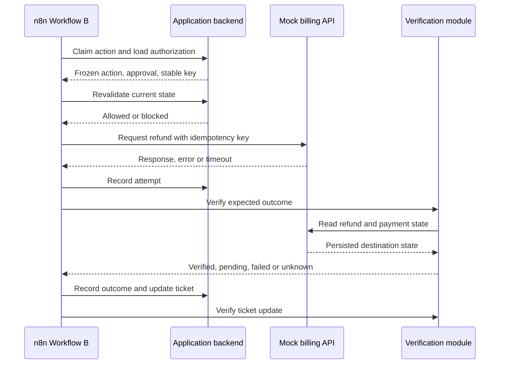
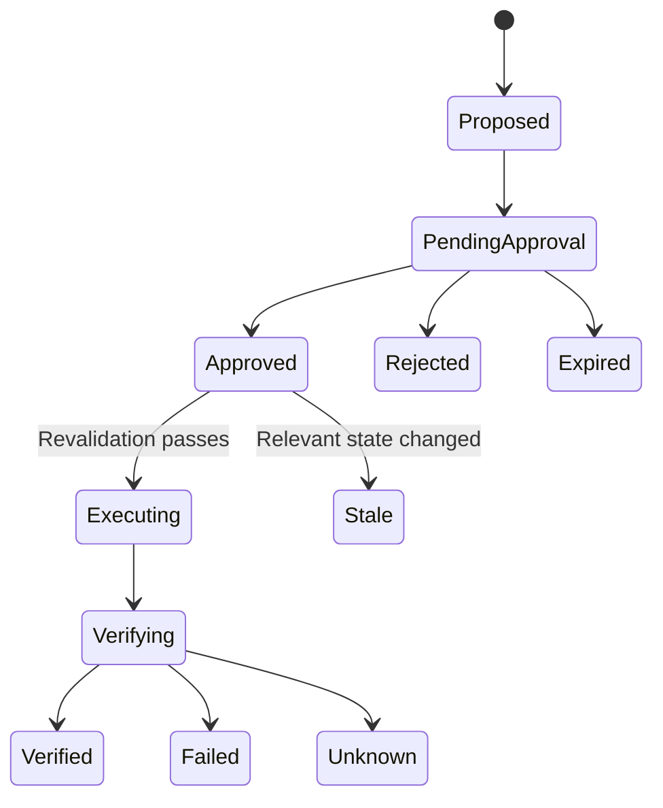

# AI Automation Lab: architecture and phased implementation plan

Research checked **13 September 2026**. This document records the planning investigation; no application code was implemented and no runtime model calls were made during that investigation.

At the time of investigation, the workspace was empty. Codex CLI **0.154.0** was installed and reported ChatGPT authentication. Node **26.5.0** and pnpm were available; Docker was not installed.

Confirmed defaults:

- **Hybrid local development:** PostgreSQL and n8n in Docker; the backend, frontend and Codex runtime on your Mac.
- **First complete demo:** support responses, escalation and approved refunds. Subscription/account repair is deferred.
- **Implementation sequence:** spike Codex once → record the result → freeze the integration choice → build RelayDesk and the n8n workflows.

Throughout this document, **Verified** means supported by current official documentation or local inspection; **Recommendation** is an architectural choice; **Spike** identifies something that still requires executable proof.

## A. Project thesis and validated assumptions

Build **AI Automation Lab**, with the subtitle **AI Support Automation Lab**:

> An open-source reference application for learning reliable AI business automation through bounded AI reasoning, deterministic workflows, human approval and independent outcome verification.

The fictional SaaS company will be **RelayDesk**, a simple subscription-based collaboration product. Its business exists to supply realistic integration problems.

The central demonstration is:

```text
Unstructured request
→ structured recommendation
→ deterministic policy
→ authorized action
→ observable side effect
→ independent verification
→ auditable outcome
```

The first release succeeds when another developer can reproduce both a successful refund and a misleading “API success” that verification correctly identifies as a business failure.

### Findings that affect the architecture

| Assumption | Finding and consequence |
|---|---|
| Everything can run locally | The application, workflows, database and simulated business systems can. Subscription-backed Codex reasoning still uses OpenAI-hosted models. This is a local lab with hosted inference, not an offline system. |
| Codex supports programmatic execution | **Verified.** `codex exec` supports non-interactive calls, JSONL events and JSON Schema-constrained final output. [Official non-interactive documentation](https://developers.openai.com/codex/noninteractive) |
| An official TypeScript SDK exists | **Verified.** The SDK wraps the CLI. It is an integration convenience, not a separate inference service or an escape from CLI authentication and permissions. [Official SDK documentation](https://developers.openai.com/codex/sdk) |
| Existing subscription authentication can be reused | **Verified technically.** Saved ChatGPT authentication is reused and refreshed during use. API-key authentication uses separate API billing and is the documented default for general automation. [Authentication documentation](https://developers.openai.com/codex/auth) |
| Codex provides unlimited free automation | **Incorrect.** Runtime calls consume the same finite allowance used for other Codex work. Availability and throughput depend on the account, model and usage limits. [Codex pricing and limits](https://learn.chatgpt.com/docs/pricing) |
| n8n Community Edition is sufficient | **Yes for this design.** The required workflow primitives are available. Paid Git integration, enterprise permissions and external secret stores are unnecessary. [Edition comparison](https://github.com/n8n-io/n8n-docs/blob/main/docs/deploy/host-n8n/community-edition-features.md) |
| Official n8n MCP only executes existing workflows | **Outdated.** Current official MCP supports building, editing, validating, testing and inspecting workflows. Details appear in section J. |
| The whole dependency stack is open source | **Incorrect.** Our application can be MIT-licensed, but n8n uses its Sustainable Use License and hosted Codex remains a proprietary service. [n8n licensing explanation](https://github.com/n8n-io/n8n-docs/blob/main/docs/n8n-community-license/README.md) |

**Cost conclusion:** zero additional API spend is a reasonable target for personal learning within existing Codex limits. It is not a guaranteed unlimited entitlement. The repository must also run with an explicitly labeled fixture provider, without any model account.

**Licensing conclusion:** the proposed personal learning lab fits n8n’s described personal/non-commercial usage. Publish our code, fixtures and workflow definitions under MIT while preserving dependency notices; do not relicense or sell n8n itself.

For Codex, official programmatic mechanisms establish technical feasibility, but do not provide blanket permission to turn a personal subscription into a shared inference service. Applicable account terms still matter, including restrictions on credential sharing, extraction and circumventing limits. Treat this as an optional personal development integration; seek OpenAI clarification if the account’s applicable terms leave the bounded non-coding use unresolved. [OpenAI Terms of Use](https://openai.com/policies/terms-of-use/)

## B. Deliberate learning objectives

| Skill | Concrete exercise |
|---|---|
| Events and orchestration | Persist a ticket, deliver its event and trace it through n8n. |
| Structured AI reasoning | Turn ambiguous text into a validated decision with explicit uncertainty. |
| Policy and permissions | Reject an unauthorized recommendation even when the model insists. |
| Human oversight | Bind approval to an exact, immutable refund proposal. |
| State management | Continue an automation after backend or n8n interruption. |
| Reliability | Recover from lost responses without duplicating refunds. |
| Verification | Detect that a successful HTTP response produced no business change. |
| Auditability | Explain what the model recommended, policy allowed, human approved and system observed. |
| Evaluation | Measure structured decisions and policy escapes across synthetic fixtures. |
| Engineering judgment | Keep business authority outside the model and avoid unnecessary services. |

n8n is one implementation of orchestration in this lab. The more transferable lessons are contracts, state transitions, authorization, recovery and evidence.

## C. End-to-end architecture and technology choices

### Recommended stack

| Layer | Choice | Reason |
|---|---|---|
| Frontend | React 19 + TypeScript + Vite 8 | A local dashboard needs neither server rendering nor Next.js server-side application machinery. |
| Backend | Node 24 LTS + Fastify 5 | Small modular server with schema validation, structured logging and straightforward HTTP testing. |
| Contracts | Zod 4, generating JSON Schema | Share application types and validation without maintaining unrelated schemas. |
| Database | PostgreSQL 18 | Transactions, constraints and concurrency control are central learning objectives. |
| Persistence access | Drizzle ORM + `pg` | Typed queries with explicit SQL migrations and visible transaction boundaries. |
| Orchestration | n8n Community Edition, regular execution mode | Enough capability without Redis or worker infrastructure. |
| AI runtime | Backend-owned `CodexProvider` | Uses the supported CLI behind a narrow interface. |
| Offline/test runtime | `FixtureProvider` | Deterministic, account-free tests and reproducible demos. |
| Tests | Vitest + Fastify injection + Playwright | Unit, real-database integration, workflow and browser coverage. |
| Workspace | pnpm workspaces | Shared packages without a separate monorepo build platform. |
| Infrastructure | Docker Compose | PostgreSQL and n8n with persistent volumes. |

Fastify’s schema-based validation suits explicit API contracts, and Zod supports native JSON Schema conversion. Use application-owned schemas only. [Fastify validation](https://fastify.dev/docs/latest/Reference/Validation-and-Serialization/), [Zod JSON Schema](https://zod.dev/json-schema)

**Initial compatibility baseline:** Node **24.21.0**, PostgreSQL **18.6**, n8n **2.38.7**, Codex CLI **0.154.0**. Pin dependencies in the lockfile and container images by exact tag and resolved digest during bootstrap. Node 24 is LTS; n8n 2.38.7 is the stable release found during this investigation. [Node releases](https://nodejs.org/en/about/previous-releases), [PostgreSQL releases](https://www.postgresql.org/docs/release/), [n8n release](https://github.com/n8n-io/n8n/releases/tag/n8n@2.38.7)

**PostgreSQL over SQLite:** SQLite could handle the data volume. PostgreSQL is preferable because concurrent approvals, refund locking, uniqueness constraints and transactional event delivery are precisely what the project should teach. One PostgreSQL container will contain separate application and n8n databases, with separate credentials. n8n supports PostgreSQL 18. [n8n database support](https://github.com/n8n-io/n8n-docs/blob/main/docs/deploy/host-n8n/configure-n8n/choose-n8ns-database.md)



These boxes represent responsibility boundaries, not separate deployed microservices.

## D. Responsibility boundaries

| Component | Owns |
|---|---|
| Frontend | Ticket submission, approvals, timelines and evidence presentation. |
| Backend | Product state, API contracts, policies, authorization and allowed state transitions. |
| n8n | Workflow sequence, branching, waits, retry scheduling and calls to application/business APIs. |
| AI application service | Context preparation, prompt/schema versions, durable AI jobs and validation. |
| `AIProvider` | A narrow reasoning request/response contract. |
| `CodexProvider` | CLI invocation, runtime configuration, cancellation and provider error translation. |
| Business API modules | Customer records, billing mutations, ticket updates and idempotency receipts. |
| Database | Authoritative business, approval, automation and audit records. |
| Human reviewer | Approve or reject a particular permitted proposal. |
| Verification module | Establish whether the expected destination state exists. |

**Policy lives in backend code.** n8n calls policy evaluation and branches on its result. The action API checks the policy again before mutation.

This preserves n8n’s orchestration role while preventing a modified workflow from bypassing essential business restrictions.

The backend’s small workers deliver events and execute AI jobs. They do not become a second general-purpose workflow engine.

### AI versus deterministic code

| AI may determine | Deterministic code determines |
|---|---|
| Likely intent and category | Whether the customer/payment exists |
| Whether wording is ambiguous | Whether records belong to that customer |
| Urgency suggested by the message | Valid priority and routing rules |
| Possible duplicate-charge concern | Whether billing evidence supports a duplicate |
| Suggested response or next step | Refund amount, currency, eligibility and limits |
| Missing or conflicting information | Required approval and approved action identity |
| A concise explanation | Whether a mutation or verification succeeded |

## E. End-to-end ticket walkthroughs

### 1. Normal support question

> “Where can I download my invoices?”

1. Save the ticket and its event.
2. Workflow A loads the ticket and customer context.
3. AI identifies an informational billing question and a permitted FAQ reference.
4. Backend policy validates that reference and authorizes a non-financial response action.
5. Workflow B writes a canonical response to the simulated support conversation.
6. Verification reads the conversation and confirms the expected message exists.
7. Dashboard shows response delivery verified.

The lab proves that the response was stored in its simulated destination. It does not claim that the customer read it.

### 2. Duplicate charge

> “I was charged twice this month.”

1. Context contains two captured payments against the same invoice.
2. AI recommends investigating a duplicate charge.
3. Code identifies the eligible duplicate, computes the refund amount and creates a frozen proposal.
4. The dashboard shows the payment, invoice, amount, evidence and policy result.
5. A reviewer approves.
6. Workflow B revalidates current payment state and approval.
7. It requests a refund using the action’s stable idempotency key.
8. Verification reads the refund and payment state.
9. The system posts a factual confirmation and verifies the ticket update.

### 3. Duplicate charge plus account mismatch

> “I was charged twice this month and my account still says Free.”

The refund follows the preceding flow. The account mismatch is recorded as an unresolved issue and assigned to human support.

The dashboard must show:

```text
Refund action       VERIFIED
Account repair      HUMAN FOLLOW-UP REQUIRED
Ticket resolution   PARTIAL
```

Do not close the ticket or claim the account was repaired.

### 4. Ambiguous request

> “This charge looks wrong. Can you sort it out?”

AI identifies insufficient information. Policy creates a clarification or human-review action. No refund proposal is executable until specific billing evidence exists.

### 5. Failed billing operation

A fixture causes billing to return HTTP 500 before committing anything.

Workflow B performs bounded retries. After exhaustion, verification checks destination state. Confirmed absence produces a failed action; inability to inspect the destination produces an unknown outcome requiring reconciliation.

### 6. Refund committed, response lost

Billing commits the refund and idempotency receipt, then drops the response.

The workflow retries using the same key. Billing returns the original result, and verification confirms exactly one refund.

### 7. API says success, nothing changed

Billing returns a synthetic success receipt without creating the refund.

Verification repeatedly finds no matching refund and no payment adjustment. After the verification deadline, the action is marked failed.

The workflow can successfully complete this failure-handling branch:

```text
Workflow execution  SUCCEEDED
Billing HTTP call   SUCCEEDED
Business outcome    FAILED
```

### 8. Human rejection

The reviewer rejects a refund proposal.

The backend records the decision and explanation, marks the action rejected, and records that no refund was performed. Workflow B’s financial branch is never started.

Rejection is a valid completed decision, not an infrastructure error.

## F. Workflow A — Triage and decision

**Trigger:** authenticated `ticket.created` event containing identifiers, not authoritative business data.

**Steps:**

1. Claim the event/run through the backend.
2. Load the current ticket.
3. Resolve the customer; route unmatched identities to human review.
4. Retrieve bounded CRM and billing context through APIs.
5. Request an asynchronous AI classification job.
6. Poll the job using n8n waits.
7. Require valid structured output.
8. Ask the backend to evaluate policy and create action proposals.
9. Branch to automatic support action, clarification, human review or approval.
10. Record the triage checkpoint and finish.

Invalid model output gets at most one controlled retry. A second failure routes to human review.

### Decision contract

The initial structured decision contains:

| Field | Purpose |
|---|---|
| `schemaVersion` | Contract compatibility |
| `category` | Billing, account, technical, general or unknown |
| `intent` | Versioned, bounded intent vocabulary |
| `priority` | Low, normal, high or urgent recommendation |
| `recommendedAction` | Reply, investigate refund, clarify or escalate |
| `needsHumanReview` | Model’s request for review |
| `ambiguity` | Clear, missing information or conflicting information |
| `evidenceRefs` | References to supplied context |
| `unresolvedIssues` | Additional requests the proposed action will not resolve |
| `reason` | Short explanation suitable for the audit trail |

It contains **no arbitrary URLs, executable instructions, permissions or model-calculated refund amounts**.

A model’s `needsHumanReview: false` cannot override a mandatory review rule. Self-reported confidence will not be treated as a calibrated probability.

## G. Workflow B — Action and verification

**Trigger:** authenticated `action.ready` event. The backend creates this after human approval or deterministic authorization of a low-risk support action.



**Execution rules:**

- Load action parameters from the backend’s frozen proposal.
- Recheck ownership, eligibility, approval expiry and policy version.
- Record an attempt before issuing a mutation.
- Preserve the idempotency key across all retries and workflow executions.
- Reconcile uncertain results before considering a new mutation.
- Generate financial confirmation from verified facts using deterministic templates.
- Keep the ticket open when unresolved issues remain.

A response-generation or ticket-update failure does not reverse a verified refund. Resume from that checkpoint.

## H. Smallest useful AIProvider abstraction

Start with one required operation:

```text
generateStructured(request, cancellation)
    → validated structured result + provider metadata
```

The request contains application-owned instructions, bounded context, an application-owned JSON Schema, a task identifier and a deadline.

The result includes:

- Validated value.
- Provider and model identity.
- Prompt and schema versions.
- Duration.
- Provider request/session identifier when available.
- Token usage when reported; otherwise absent.

Normalize failures into:

```text
authentication_required
quota_exceeded
rate_limited
timeout
cancelled
invalid_output
unsupported_capability
provider_unavailable
security_violation
```

Do not accept a user-supplied prompt, schema, model identifier or provider configuration through a general-purpose public endpoint.

`generateText` is deferred until an actual response-drafting milestone needs it. Financial confirmations initially use deterministic templates.

### Provider replacement

n8n calls application endpoints such as “classify this run.” It does not know about Codex threads, CLI arguments or vendor response objects.

A future adapter implements the same contract and declares relevant capabilities:

- Native schema-constrained output versus application validation.
- Cancellation support.
- Available usage metadata.
- Input/output limits.

A provider unable to meet a required capability must report that limitation. It must not silently weaken the contract.

Do not add a universal conversation framework, LangChain, an agent framework or unused adapters.

## I. Codex integration and required spike

### Recommended integration

Use **direct `codex exec` invocation from Node’s process API** for the first adapter.

The official TypeScript SDK is viable: it supports `outputSchema`, streaming events and an `AbortSignal`. However, direct CLI invocation gives this small adapter explicit control over isolated configuration, ephemeral sessions and process-tree cleanup. The SDK itself still spawns the CLI. [Official SDK source](https://github.com/openai/codex/tree/rust-v0.154.0/sdk/typescript)

The app-server is unnecessary here; it is more appropriate when building a richer Codex client with conversations and approvals.

### Invocation design

- Use a pinned, absolute executable path.
- Pass an argument array with shell execution disabled.
- Supply customer context over stdin.
- Use a fresh process and isolated working directory per job.
- Request JSONL events and a schema-constrained final answer.
- Use read-only sandboxing, non-interactive approval policy and ephemeral sessions.
- Exclude developer configuration, project instructions, MCP connections and installed development tooling.
- Explicitly disable shell execution, web search, apps, subagents and other unnecessary tools using supported configuration.
- Treat unexpected tool activity as a security failure.

Current configuration exposes controls for shell tools, web search, apps and subagents. **Their combined effectiveness must be proved against the pinned runtime.** Read-only mode alone does not mean “cannot inspect files” or “has no tools.” [Codex configuration reference](https://learn.chatgpt.com/docs/config-file/config-reference)

### Runtime defaults

| Setting | Initial default |
|---|---|
| Concurrent Codex jobs | 1 |
| Pending queue limit | 20 |
| Per-invocation deadline | 180 seconds |
| Termination grace | 5 seconds, then force termination |
| Structured final-output limit | 64 KiB |
| Captured process-output limit | Bounded separately; terminate on overflow |
| Context size | Application-limited, initially 32 KiB |
| Session reuse | None between tickets |
| Model selection | Server configuration only |
| Paid fallback | None |

Select one available capable model during the spike, record its identity and use it consistently. Do not build a model picker or compare models.

### Authentication

Use a dedicated runtime configuration/credential location, authenticated by the local operator through the official login flow.

Do not copy the developer’s entire Codex home into the runtime, bundle credentials, or commit authentication files. Test whether dedicated storage and OS-keychain behavior remain properly separated.

The runtime must detect authentication loss and request local reauthentication through dashboard status. It must not hang waiting for an interactive login.

### Spike acceptance criteria

Before enabling live runtime mode, prove:

1. One synthetic ticket produces schema-valid output using ChatGPT authentication.
2. No API key is required or selected accidentally.
3. Repeated calls work without an interactive approval prompt.
4. Effective tool exposure excludes all unwanted capabilities.
5. Prompt-injection fixtures cannot read canary files, execute commands, contact MCP or alter files.
6. Timeout and cancellation leave no child process running.
7. Invalid JSON, missing final output and nonzero exit are handled predictably.
8. Expired authentication, quota exhaustion and unavailable models fail safely.
9. Runtime configuration does not inherit developer MCP credentials, hooks or instructions.
10. Latency and allowance consumption are acceptable for small local batches.

Run a small fixed sample, not a model benchmark. Timebox the Codex investigation to **one focused working session, at most half a day**. The harness is a disposable feasibility check, not a reusable developer tool or a separate project.

At the end of that session, record pass/fail evidence, unresolved limitations, the pinned CLI version, chosen model and supported invocation/configuration. Freeze the result and move directly into RelayDesk and n8n. If a required property remains unproved, keep live Codex disabled and proceed with `FixtureProvider`; do not extend the spike to chase it.

Reopen the Codex decision only for a concrete integration blocker, security issue or regression encountered while building the actual automation system. Do not undertake additional model comparisons, prompt tuning or runtime experiments as a follow-on phase.

**Go/no-go:** if the bounded security configuration cannot be established, do not enable `CodexProvider`. Continue the lab with `FixtureProvider`; do not compensate with stronger prompts or broader permissions.

## J. n8n integration, MCP and workflow version control

### Community Edition

Use one n8n instance in **regular mode**, backed by PostgreSQL.

Community Edition supports this project’s webhooks, HTTP calls, branching, sub-workflows, waits, retries and execution inspection. Queue mode is also available, but adds Redis and workers without serving the initial learning objective. Paid features omitted from the plan include built-in Git source control, environments, external secret stores, enterprise sharing/SSO and log streaming. [Community capabilities](https://github.com/n8n-io/n8n-docs/blob/main/docs/deploy/host-n8n/community-edition-features.md), [Queue mode](https://github.com/n8n-io/n8n-docs/blob/main/docs/deploy/host-n8n/configure-n8n/scaling/enable-queue-mode.md)

### Official MCP findings

**Use the built-in instance-level MCP server.** No third-party n8n MCP package is required.

| Developer operation | Current official capability |
|---|---|
| Inspect workflows | Search and workflow-detail tools |
| Create workflows | `create_workflow_from_code` |
| Edit workflows | `update_workflow` |
| Validate | `validate_workflow` |
| Discover node contracts | Node search/type tools |
| Test with simulated node outputs | `test_workflow` and pin-data preparation |
| Run workflows | `execute_workflow` |
| Inspect executions | Execution lookup and search |
| Debug failures | Inspect node data/errors, edit and retest |

Execution through MCP does not support human-in-the-loop interactions end-to-end. Pin-data testing also allows some unpinned nodes to execute normally, so it is not an all-purpose sandbox. [Official MCP tools reference](https://github.com/n8n-io/n8n-docs/blob/main/docs/connect/connect-to-n8n-mcp-server/mcp-server-tools-reference.md)

**Version findings:** official pages differ on historical introduction: the tool reference labels several builder tools 2.12, the setup guide says building/editing from 2.13, and the product page specifies 2.18.3+ for its current offering. Later releases change tool names and behavior. Set this project’s initial minimum/tested version to **2.38.7**, rather than promising compatibility with the earliest introduction. [MCP setup](https://github.com/n8n-io/n8n-docs/blob/main/docs/connect/connect-to-n8n-mcp-server.md), [n8n MCP product page](https://n8n.io/mcp/)

### Development connection

- Enable instance-level MCP as the local instance owner.
- Connect developer Codex to the instance’s `/mcp-server/http` endpoint.
- Prefer OAuth; use an environment-backed bearer token only when necessary.
- Expose only lab workflows.
- Keep automatic exposure of new workflows disabled.
- Discover the actual advertised tool inventory before generating workflows.

Official documentation includes Codex connection and OAuth login instructions. [n8n’s Codex example](https://github.com/n8n-io/n8n-docs/blob/main/docs/connect/connect-to-n8n-mcp-server/mcp-client-examples.md)

MCP access is user-scoped, and workflow discovery can reveal previews beyond the individually exposed workflows. OAuth permissions and workflow exposure are distinct controls. Runtime Codex receives neither this connection nor its credentials.

### Workflow development loop

1. Read the node contracts exposed by the pinned instance.
2. Generate or modify the workflow.
3. Validate it.
4. Run fixture-based logic tests.
5. Inspect the canvas and meaningful node names.
6. Execute real integration tests.
7. Export, sanitize and review the JSON diff.
8. Commit the reviewed workflow.

### Source of truth

**Git-tracked normalized JSON is the canonical workflow definition.**

Use n8n’s supported import/export CLI for reproducible installation. Preserve graph structure, node versions, names, positions and notes. Remove execution data, secrets and environment-specific values.

Keep a small installation manifest for workflow identities, credential references and local API base URLs. Installer tooling must update only this project’s workflows, not arbitrary instance content.

Imports and publishing have lifecycle/restart implications; implement a controlled import-and-restart procedure against the pinned release. [n8n CLI](https://github.com/n8n-io/n8n-docs/blob/main/docs/deploy/host-n8n/configure-n8n/use-the-command-line.md)

Do not maintain independently editable SDK code and JSON representations.

n8n’s version history is useful for immediate recovery, but Community users only receive limited history. Git remains the durable record. [Workflow history](https://github.com/n8n-io/n8n-docs/blob/main/docs/build/manage-workflows/view-change-history.md)

### Workflow count

Start with:

- `triage-decision`
- `action-verification`
- `automation-error-handler`

Add a reusable sub-workflow only when actual duplication warrants it. Add a separate Wait/resume exercise later.

## K. Minimum useful data model

Use relational tables for entities and constraints; JSONB for versioned decisions, snapshots and evidence.

| Entity | Essential contents |
|---|---|
| Customer | ID, fictional name/email, account status, effective account plan |
| Subscription | Customer, subscribed plan, status, renewal date |
| Invoice | Customer/subscription, billing period, expected amount, currency |
| Payment | Invoice/customer, captured amount, currency, status, refunded amount, timestamps |
| Refund | Payment, amount, currency, status, action reference, timestamps |
| Ticket | Customer or unresolved customer reference, message, status, priority, category, unresolved issues |
| Ticket message | Ticket, author type, text, visibility, action reference |
| Automation run | Ticket, phase, workflow revision, decision/policy snapshots, outcome |
| Workflow execution | Run, n8n execution ID, attempt, technical status, timing |
| Proposed action | Run, kind, frozen parameters, policy version, status, idempotency key |
| Approval | Action, proposal version/hash, status, reviewer, decision reason, expiry |
| AI job | Run/task, input hash, provider/model, status, result/error, timing |
| Audit event | Actor, run/action references, event type, timestamp, safe evidence |
| Outbox event | Event ID/type, references, delivery status, attempts, next attempt |
| Operation receipt | Operation/key, request hash, recorded result |
| Scenario instance | Fixture ID, scoped fault configuration and durable fault counters |

Add these incrementally with the milestone that needs them.

**Important choices:**

- Include invoices because matching two equal amounts alone does not prove a duplicate.
- Keep subscription plan and effective account plan distinct to model synchronization failures intentionally.
- Use integer minor currency units, never floating-point money.
- Start with one currency: USD.
- Use UTC storage and an injectable clock.
- Use reserved fictional addresses such as `customer-014@example.test`.
- Allow an unresolved customer reference without violating a foreign key.
- Represent the small set of support agents as seeded identities; no agent-management product.
- Defer orders and order items until an order-specific workflow exists.

Audit events also store verification evidence; a separate verification table is unnecessary initially.

## L. Directional APIs and event contracts

Expose versioned HTTP JSON APIs, with generated OpenAPI documentation.

### Dashboard APIs

| Endpoint | Purpose |
|---|---|
| `POST /api/v1/tickets` | Submit a synthetic support request |
| `GET /api/v1/tickets` | List tickets |
| `GET /api/v1/tickets/:id` | Ticket, messages and unresolved issues |
| `GET /api/v1/runs/:id` | Timeline, decisions, executions and outcomes |
| `GET /api/v1/approvals` | Pending/history views |
| `POST /api/v1/approvals/:id/decision` | Approve/reject the specified proposal version |
| `POST /api/v1/runs/:id/reconcile` | Request safe recovery of an uncertain run |
| `POST /api/v1/scenarios/:id/start` | Start an explicit lab fixture |

### Mock business APIs

```text
GET  /integrations/v1/customers/:id
GET  /integrations/v1/customers/:id/subscription
GET  /integrations/v1/customers/:id/payments
GET  /integrations/v1/invoices/:id
GET  /integrations/v1/payments/:id

POST /integrations/v1/refunds
GET  /integrations/v1/refunds/:id
GET  /integrations/v1/refunds?paymentId=...&actionId=...

POST /integrations/v1/tickets/:id/messages
POST /integrations/v1/tickets/:id/close
GET  /integrations/v1/tickets/:id
```

Refund requests carry a stable idempotency key and an action reference. Submitted payment/amount fields must match the backend’s authorized proposal.

### Automation coordination APIs

Provide narrow operations for:

- Claiming an event/run/action.
- Loading workflow context.
- Creating and polling AI jobs.
- Evaluating policy.
- Revalidating an action.
- Recording action attempts.
- Initiating verification.
- Completing a permitted workflow stage.

Do not expose “set approval to approved” or “set business outcome to verified” as generic writable fields.

Events contain:

```text
eventId
eventType
schemaVersion
occurredAt
runId
ticketId
actionId, when applicable
```

Consumers reload authoritative state. An event claiming that an action is approved is insufficient authorization by itself.

## M. Human approval model

Use **database-backed approval followed by an event**, rather than keeping every approval inside a waiting n8n execution.



### Approval rules

- Every refund requires a human reviewer.
- Approval binds to exact action parameters and their version/hash.
- Approval expires after 24 hours.
- Changed payment state, proposal parameters or policy version requires reevaluation.
- An approval cannot override an unsupported action or hard policy restriction.
- Approve/reject uses an atomic pending-state transition.
- Repeated identical decisions are harmless; conflicting decisions return a conflict.
- Approval and its outgoing action event are committed together.
- Rejection records a reason and causes no financial mutation.

The UI displays target payment, invoice, amount, evidence, expiry and unresolved issues.

### Native Wait/resume learning exercise

n8n’s Wait node can persist execution data and resume from an authenticated callback. Time waits shorter than 65 seconds remain in-process instead of being offloaded to the database. [Wait node documentation](https://github.com/n8n-io/n8n-docs/blob/main/docs/integrations/builtin/core-nodes/n8n-nodes-base.wait.md)

Build one later exercise with:

- An authenticated resume URL kept behind the backend.
- Approval recorded before the backend attempts resume.
- Recovery if approval arrives before the wait is ready.
- Retry after a lost callback.
- Duplicate callback and expiry handling.
- Restart during a persisted wait.

The resume callback never substitutes for checking the approval record.

## N. Reliability, state, verification and observability

### Delivery and recovery

Use **at-least-once delivery**, with explicit duplicate handling.

When creating a ticket or approving an action, write its outbox event in the same PostgreSQL transaction. A backend worker delivers events and records transport attempts.

A successful webhook response means delivery was accepted, not that processing completed. Reconciliation detects runs that were delivered but never claimed or that stopped advancing.

Use database-backed claims and leases to prevent concurrent execution. Preserve completed checkpoints across new n8n execution attempts.

### Idempotency

For each logical action, generate one backend-owned key, such as:

```text
action:<action-id>:refund:v1
```

The business API must:

1. Authenticate the caller.
2. Find an existing receipt for the operation/key.
3. Reject the same key with different parameters.
4. For a new operation, lock and validate the payment.
5. Atomically write the refund, payment adjustment, receipt and business audit event.
6. Return the original result for an identical replay.

Also enforce business constraints across **different keys**. Two independently generated actions must not fully refund the same payment twice.

For the initial full-refund-only model, a unique eligible refund/action constraint and transactional payment checks make this simpler.

### Initial refund policy

A refund proposal is actionable only when:

- Customer, invoice and payment ownership match.
- The invoice has evidence of duplicate captured payment.
- The selected payment is the later duplicate; ties use a stable ID ordering.
- The refund is for the full eligible payment amount.
- No prior refund exists.
- Payment age is at most 30 days.
- Amount is at most USD 100.
- Human approval is current.

Other cases go to human support. These are fictional teaching rules, versioned as `refund-policy-v1`.

### Retry ownership and defaults

| Operation | Default |
|---|---|
| Business API call | Three total attempts |
| Transient retry delays | 1 second, then 4 seconds |
| HTTP 429 | Honor bounded `Retry-After`; otherwise use normal backoff |
| Non-retryable errors | Invalid request, forbidden action, missing resource, stale approval |
| AI malformed output | One additional attempt |
| Verification reads | Immediately, then after 2, 5, 10 and 20 seconds |
| Recovery | Reuse the same action and inspect destination state first |

n8n schedules business retries. The backend enforces persisted attempt limits so restarting a workflow does not reset its retry budget.

Outbox delivery has a separate capped backoff. Exhausted deliveries remain visible and replayable.

Do not layer unbounded retries in the HTTP library, provider wrapper and workflow.

### Independent verification

For a refund, verify:

- A persisted refund is associated with the expected action/payment.
- Customer, amount and currency match.
- Refund status is completed.
- Payment totals reflect that refund.
- No duplicate refund was created.

The verification module reads through the business system’s read API using read-only business permissions. It cannot call mutation methods and does not trust the action response as evidence.

This is **independence of code path and authority**, not a claim of separate infrastructure: the simulated systems initially share one backend and database server.

Stale reads produce a pending verification result until the bounded observation period ends.

### Outcome semantics

Keep three concepts distinct:

| Concept | Examples |
|---|---|
| n8n execution status | Running, waiting, success, error, crashed |
| Action business outcome | Pending, verified, failed, unknown, not performed |
| Ticket resolution | Open, awaiting customer, human follow-up, partial, resolved |

Use `unknown` when evidence is unavailable. Do not convert an uncertain timeout into a claim that nothing happened.

### Fault injection

Faults are explicit fixture configuration, never activated by customer text.

Support:

- Invalid AI output.
- Missing customer.
- Failure before billing commit.
- Timeout before commit.
- Commit followed by lost response.
- Rate limit.
- Duplicate delivery/request.
- Stale read for a fixed number of reads.
- Success response without mutation.
- Temporary service unavailability.
- Backend/n8n interruption.

Scope fault counters to a scenario/action and persist them. Restarting must not accidentally reset “fail the first request.”

### Audit and observability

Every run links:

```text
ticket → event → run → AI job → decision → policy
→ proposal → approval → API attempt → verification → response
```

Store actor, timestamps, workflow revision, prompt/schema/policy versions and concise evidence.

Use structured backend logs with correlation IDs. Dashboard metrics initially cover:

- Runs by phase/outcome.
- Approval age.
- Retry and duplicate counts.
- Verification failures and unknown outcomes.
- Provider error counts.
- Queue time and provider latency separately.

Use n8n execution history for debugging, with explicit retention. Keep application audit history independently. n8n can prune execution data and configure progress/error retention. [Execution persistence settings](https://github.com/n8n-io/n8n-docs/blob/main/docs/deploy/host-n8n/configure-n8n/basic-configuration/use-environment-variables/executions.md)

## O. Testing and AI evaluation

### Test layers

| Layer | Important assertions |
|---|---|
| Policy unit tests | Eligibility, ownership, limits, ambiguity and mandatory approval |
| Database integration | Concurrent refunds, duplicate keys, changed payloads and approval races |
| Provider adapter tests | Process errors, timeout, cancellation, malformed output and bounded capture |
| Workflow logic tests | Branch selection using fixture/pinned outputs |
| Real n8n integration | Webhooks, backend calls, approvals, retries and verification |
| Browser tests | Reviewer actions, timeline clarity and accurate status labels |
| Recovery tests | Restart at each important checkpoint without duplicate effects |

Use PostgreSQL for transaction tests rather than substituting SQLite.

### n8n automation tests

Import canonical workflows into a disposable n8n/PostgreSQL environment, configure test credentials, publish and invoke actual webhooks.

Drive approvals through the application API, then assert:

- Backend state.
- Destination business state.
- Audit evidence.
- n8n execution results.

MCP testing is an additional developer aid. CI must not require Codex or any MCP client.

Test the error workflow through automatic execution: n8n’s Error Trigger does not run for ordinary manual tests. [Error Trigger documentation](https://github.com/n8n-io/n8n-docs/blob/main/docs/integrations/builtin/core-nodes/n8n-nodes-base.errortrigger.md)

### Evaluation corpus

Start with 20 development fixtures; expand to 100:

- Billing questions and duplicate charges.
- Account/subscription issues.
- Technical support.
- Cancellation requests.
- Missing/conflicting context.
- Angry but ordinary requests.
- Ambiguous requests.
- Unsupported actions.
- Harmless prompt injection.

Keep 80 fixtures held out from routine prompt iteration.

Expected labels include category, intent, required escalation, permitted recommendation set and final policy/approval requirements.

Measure:

- Category and intent accuracy.
- Allowed-action selection accuracy.
- Escalation precision and recall.
- First-attempt malformed-output rate.
- Recovery after invalid output.
- Unsafe recommendations blocked by policy.
- Actual policy escapes.
- Provider and end-to-end latency.

Do not score exact response wording or use the fixture provider to claim model accuracy.

### Initial acceptance gates

- All deterministic reliability scenarios pass.
- Zero unauthorized financial actions.
- Zero duplicate refunds.
- Every missing-approval/injection safety fixture remains contained.
- Every required escalation fixture escalates.
- At least 90% category accuracy and 85% allowed-action accuracy on the initial held-out set.

These are project acceptance targets, not production safety guarantees.

Live evaluations are opt-in, sequential and call-budgeted. Public CI uses fixtures and never receives personal Codex credentials.

## P. Security model

### Local application

- Bind host services and published container ports to loopback.
- Use authenticated webhooks.
- Give n8n workflow credentials no permission to approve actions.
- Use a separate local reviewer session for approval endpoints.
- Derive reviewer identity server-side.
- Enforce same-origin browser access, CSRF protection and request-size limits.
- Render ticket text as plain text or sanitized content.
- Keep scenario controls restricted to the operator.
- Reject arbitrary callback destinations and business API URLs.

This is a single-operator lab with distinct principals, not enterprise authentication.

### Runtime Codex

The child process receives an allowlisted environment without database passwords, reviewer secrets, n8n API keys or MCP tokens.

Use no shell interpolation, user-controlled executable paths, user-selected filesystem paths or customer-controlled configuration.

A dedicated runtime home is necessary but insufficient on its own. Tool removal, permissions and the isolation spike provide the actual boundary.

Do not store or display raw private reasoning. Record only the structured recommendation, concise explanation, usage metadata and sanitized errors.

### Developer Codex → n8n MCP

Treat developer MCP access as trusted development authority: it can change behavior and run workflows using configured credentials.

- Use a dedicated lab instance.
- Keep real integrations and credentials out.
- Restrict enabled MCP tools to required development operations.
- Review workflow changes and exported diffs.
- Do not expose instance MCP publicly for this project.
- Keep runtime Codex completely disconnected.

Codex supports MCP tool allowlists and environment-backed bearer tokens. [Codex MCP configuration](https://developers.openai.com/codex/mcp)

### n8n credentials and nodes

Persist `N8N_ENCRYPTION_KEY` securely and retain the n8n data volume. Do not export decrypted credentials into Git. [Credential encryption](https://github.com/n8n-io/n8n-docs/blob/main/docs/deploy/host-n8n/configure-n8n/basic-configuration/configuration-examples/set-a-custom-encryption-key.md)

Disable unnecessary command/file nodes, community packages and environment access from workflow expressions. Prefer built-in HTTP, branching and wait nodes.

Community REST API keys do not offer Enterprise-style scopes; treat any backend-held execution-inspection key as broadly privileged and keep it out of model processes. [n8n API authentication](https://github.com/n8n-io/n8n-docs/blob/main/docs/connect/n8n-api/authentication.md)

## Q. Local development and reproducibility

### Normal development

**Docker Compose:**

- PostgreSQL.
- n8n.
- Named persistent volumes.
- Health checks.
- Separate database users and databases.

**Mac host:**

- React development server.
- Fastify server.
- Backend outbox/AI workers.
- Isolated Codex processes when enabled.

Use native ARM64 images. Do not force x86 emulation.

Docker Desktop is a practical default for this personal educational use; its free eligibility has limits for larger commercial organizations. [Docker Desktop licensing](https://docs.docker.com/desktop/setup/install/mac-install/)

### Networking

Use `host.docker.internal` for n8n-to-host requests and prove reachability to the loopback-bound backend during setup. [Docker Desktop networking](https://docs.docker.com/desktop/features/networking/)

If that path does not reach loopback on the installed Docker configuration, use an explicit Docker Desktop host-networking profile and test its bindings. Do not silently solve connectivity by exposing the backend to the LAN. Docker Desktop supports opt-in host networking from version 4.34. [Host networking](https://docs.docker.com/engine/network/drivers/host/)

### Intended commands

```text
pnpm doctor             Check versions, Docker, ports and provider readiness
pnpm setup              Generate local secrets, migrate and seed
pnpm dev                Start infrastructure and apps in fixture mode
pnpm dev:codex          Start with the validated Codex runtime
pnpm workflows:import   Install reviewed workflow definitions
pnpm workflows:export   Export and sanitize lab workflows
pnpm test               Deterministic tests
pnpm test:integration   Actual PostgreSQL and n8n tests
pnpm eval:live          Explicit, budgeted Codex evaluation
pnpm lab:reset          Explicitly reset synthetic application data
```

One command should start the normal environment **after one-time setup**. Be honest about initial Docker installation, n8n owner setup and Codex login.

Normal startup must not reset data, regenerate encryption keys or unexpectedly invoke a live model.

Do not include n8n Assistant’s optional model, search or privileged sandbox infrastructure. It is unnecessary for using n8n’s workflow editor and developer MCP.

## R. Open-source repository and dashboard

```text
apps/
  web/
  api/
packages/
  contracts/
  ai/
workflows/
  definitions/
  manifest.json
fixtures/
  business/
  scenarios/
  tickets/
evals/
docs/
  REPOSITORY_WORKFLOW.md
  VIDEO_CHECKPOINTS.md
  architecture/
  decisions/
  guides/
docker/
scripts/
```

Keep domain, policy, persistence and verification modules inside the backend initially. Extract packages only when another application actually needs them.

Use MIT for original project material, with dependency notices and a clear explanation that n8n and hosted model services retain their own terms. PostgreSQL uses a permissive open-source license. [PostgreSQL license](https://www.postgresql.org/about/licence/)

### Dashboard scope

Build four views:

1. **Tickets:** queue and ticket detail.
2. **Run detail:** decision, policy, authorization, action attempts and verification timeline.
3. **Approvals:** pending proposals and decision history.
4. **Lab scenarios:** select, run and inspect deterministic experiments.

Use accessible status labels, expandable evidence and links to matching n8n executions. Poll for updates initially; WebSockets are unnecessary.

Show fixture/live mode prominently. Keep technical detail in expandable panels so the main story remains understandable.

### Documentation

Include:

- Quickstart independent of YouTube.
- Architecture and responsibility boundaries.
- AI versus deterministic code examples.
- Separate developer/runtime Codex guides.
- Scenario catalog with commands and expected evidence.
- Recovery and debugging guide.
- Provider contract.
- Evaluation methodology.
- Security, licensing and cost notes.
- Contribution guide and workflow-review checklist.

### Repository history and Dharmendra Thinks

While implementing this plan, follow [Repository workflow and video evidence](docs/REPOSITORY_WORKFLOW.md). It defines meaningful commits, annotated local milestone tags, reproducible evidence and the milestone completion report.

Supporting future **Dharmendra Thinks** videos is a secondary objective. Correct engineering remains primary. Preserve the approved milestone structure; do not add complexity, features or artificial work splits to manufacture episodes.

Maintain [Video checkpoints](docs/VIDEO_CHECKPOINTS.md) separately from engineering milestones. Add a checkpoint only for a real technical question with an observable experiment and meaningful evidence. Fixture demonstrations must be labeled **FIXTURE MODE**; claims about live AI require **LIVE AI MODE** evidence. A milestone does not automatically warrant a video.

## S. Phased implementation milestones

| Milestone | Runnable/testable result | Exit criteria |
|---|---|---|
| **0. One-time Codex gate** | Minimal Codex feasibility harness and a frozen decision record | Finish within one focused session, at most half a day; record pass/fail and limitations, then stop Codex experimentation |
| **1. RelayDesk foundation** | Local PostgreSQL/n8n setup and API with customers, subscriptions, invoices, payments, tickets and deterministic seed data | Prove networking and workflow import/bootstrap; real PostgreSQL migrations and API tests; ticket creation produces durable outbox event |
| **2. First orchestration** | Workflow A using `FixtureProvider` | Ticket event reaches n8n; classification/policy recorded; duplicate delivery creates no duplicate logical work |
| **3. Verified support response** | Workflow B posts a canonical support response | Destination message read back and verified; timeline visible in a minimal UI |
| **4. Approved refund** | Proposal, reviewer UI, refund API and verification | No approval means no refund; approval binds exact action; happy-path refund is verified |
| **5. Reliability lab** | Lost-response, retries, false-success and restart scenarios | All requested failure scenarios pass; no duplicate refunds; unknown states reconcile safely |
| **6. Wire in live AI and evaluate automation** | Frozen, validated Codex integration connected behind existing endpoints | Reuse the milestone 0 decision without a new Codex research phase; same workflows work unchanged; evaluate structured workflow decisions with 20 fixtures initially, then 100 |
| **7. Teaching release** | Polished dashboard, docs and clean-clone setup | Contributor can run both success and failure demos without videos or model credentials |
| **8. Wait/resume exercise** | Native n8n persisted-wait scenario | Callback race, duplicate callback and restart behavior are documented and tested |

If milestone 0’s Codex security or account-use gate fails, milestones 1–5 and 7 remain executable in fixture mode. No paid provider is silently substituted.

### Completion discipline for every milestone

Before moving to the next milestone, complete the [milestone closeout procedure](docs/REPOSITORY_WORKFLOW.md#milestone-closeout). Each milestone must have runnable code, passing relevant tests, updated documentation, reproducible fixtures/scenarios, reviewed n8n workflow definitions where applicable and a clear Git checkpoint.

Use small, meaningful commits throughout implementation. Create the annotated local milestone tag only after its acceptance criteria pass and the relevant code, documentation and evidence are committed. Do not rewrite tagged history or push commits/tags unless the normal repository workflow explicitly requires it.

Report what completed, tests/results, the milestone tag and whether a worthwhile video experiment exists. If none exists, explicitly report **“No video is warranted yet.”** Do not automatically start designing a video.

## T. Technical spikes and decision gates

| Spike | Must establish | Failure response |
|---|---|---|
| Codex bounded reasoning | Authentication, structured output, tool isolation and cancellation | Keep live provider disabled |
| Subscription suitability | Account-compatible use and acceptable small-batch allowance | Fixture mode; clarify with OpenAI if needed |
| n8n MCP | Actual tool inventory and create/edit/test/inspect cycle on 2.38.7 CE | Use supported CLI/REST workflow maintenance |
| Workflow bootstrap | Clean import, credential binding, publishing and repeat installation | Block orchestration rollout until a supported reproducible sequence exists; avoid private APIs/DB hacks |
| Hybrid networking | Authenticated container-to-host access without LAN exposure | Use the explicit host-networking profile |
| Financial recovery | Concurrent requests and committed-but-lost responses | Fix transaction/receipt design before live AI integration |
| Wait persistence | Restart and resume behavior on the pinned n8n release | Keep the database-backed approval/event pattern authoritative |

Record spike results as short architecture decisions: command/configuration tested, versions, expected behavior, actual behavior and remaining limitation.

The Codex and subscription checks belong to the single milestone 0 session. The other checks are performed when their RelayDesk/n8n milestone needs them; they are not a separate research backlog that delays building the system.

## U. Explicitly deferred features

Defer:

- Real Stripe, CRM, email, Slack and order integrations.
- Automatic account/subscription repair.
- Partial refunds, multiple currencies and real billing.
- Additional model adapters and model comparison.
- Ollama tuning and local-inference optimization.
- Autonomous tool loops, multi-agent and computer-use systems.
- RAG, vector databases and embeddings.
- Redis/queue mode, Kubernetes and Kafka.
- Enterprise authentication, complex RBAC and multi-tenancy.
- Production deployment and public runtime endpoints.
- Mobile apps and a broad administration product.

For a future agent experiment, reuse the same narrow business tools, approval records and verifier. An agent may propose a sequence of tool calls; it still receives no authority to approve financial actions or certify its own success.

Do not build that abstraction now.

## V. Recommended first implementation task

**Build the isolated Codex feasibility harness once, then freeze it.**

Its entire job:

> Accept one fixed synthetic ticket and context, invoke the pinned Codex CLI with a strict schema and disabled tools, then return either a validated decision or a typed failure.

Use a fake executable to check malformed output, timeout, cancellation and unexpected tool activity. Follow with a small opt-in live smoke test. Keep the harness to the minimum needed to answer the feasibility questions within the single-session timebox; do not build a general-purpose testing platform.

No dashboard, database, refunds or n8n workflow is needed for this first coding task.

Record the result, freeze the invocation/configuration and stop experimenting with Codex. A failed or inconclusive gate selects `FixtureProvider` rather than extending the investigation.

Immediately move to RelayDesk and n8n. The first application feature is **persisting a synthetic ticket and its outbox event in one PostgreSQL transaction**, followed by delivering that event to the first n8n workflow.
